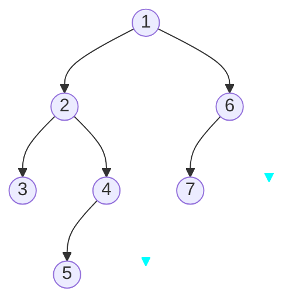
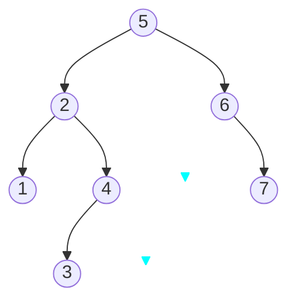
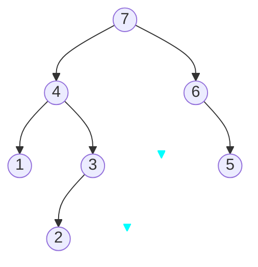

import Tabs from '@theme/Tabs'
import TabItem from '@theme/TabItem'

## 树的遍历方法

js 是没有树这个数据结构的，但是可以用 Array 和 Object 两种数据结构来组合表示

可以用如下代码来表示一个树

```ts
const tree = {
    val: 'a',
    children: [
        {
            val: 'b',
            children: [
                {
                    val: 'd',
                    children: [],
                },
                {
                    val: 'e',
                    children: [],
                },
            ],
        },
        {
            val: 'c',
            children: [
                {
                    val: 'f',
                    children: [],
                },
                {
                    val: 'g',
                    children: [],
                },
            ],
        },
    ],
}
```

<Tabs>
    <TabItem value="1" label="深度优先遍历" default>

深度优先遍历如下图所示:

```bash
└── a (1)
    │── b (2)
    │    ├── d (3)
    │    └── e (4)
    └── c (5)
        ├── f (6)
        │
        └── g (7)
```

```ts
const dfs = (root) => {
    console.log(root.val)
    root.children.forEach(dfs)
}

dfs(tree)
```

```
output:
a
b
d
e
c
f
g
```

深度优先遍历用了递归的思想

</TabItem>

<TabItem value="2" label="广度优先遍历">

广度优先遍历如下图所示:

```bash
└── a (1)
    │── b (2)
    │    ├── d (4)
    │    └── e (5)
    └── c (3)
        ├── f (6)
        │
        └── g (7)
```

广度优先遍历需要用到队列的思想，如果是要做成如上顺序的输出

1. 新建一个队列
2. 队头出队并且访问
3. 队头的 children 入队
4. 以上步骤不断遍历

```ts
const bfs = (root) => {
    const q = [root]
    while (q.length > 0) {
        const n = q.shift()
        console.log(n.val)
        n.children.forEach((v) => {
            q.push(v)
        })
    }
}

bfs(tree)
```

```
output:
a
b
c
d
e
f
g
```

</TabItem>

</Tabs>

## 二叉树

二叉树在 js 可以用对象表示

```ts
const bt = {
    val: 1,
    left: {
        val: 2,
        left: {
            val: 4,
            left: null,
            right: null,
        },
        right: {
            val: 5,
            left: null,
            right: null,
        },
    },
    right: {
        val: 3,
        left: {
            val: 6,
            left: null,
            right: null,
        },
        right: {
            val: 7,
            left: null,
            right: null,
        },
    },
}
```

### 递归方法遍历

<Tabs>
<TabItem value="1" label="先序遍历" default>

先序遍历就是 **根左右** 的顺序进行遍历，如下图所示



案例：
如果使用上述代码的话，使用先序遍历的代码如下

```ts
const preOrder = (root) => {
    if (!root) {
        return
    }

    console.log(root.val)
    preOrder(root.left)
    preOrder(root.right)
}

preOrder(bt)
```

```
output:
1
2
4
5
3
6
7

```

</TabItem>

<TabItem value="2" label="中序遍历">

中序遍历就是 **左根右** 的顺序进行遍历,如下图所示



用代码表示如下：

```ts
const inOrder = (root) => {
    if (!root) {
        return
    }

    inOrder(root.left)
    console.log(root.val)
    inOrder(root.right)
}
```

```
output:
4
2
5
1
6
3
7
```

</TabItem>

<TabItem value="3" label="后序遍历">

后序遍历就是 **左右根** 的顺序进行遍历,如下图所示



代码表示如下

```ts
const postOrder = (root) => {
    if (!root) {
        return
    }

    postOrder(root.left)
    postOrder(root.right)
    console.log(root.val)
}
```

```
output:
4
5
2
6
7
3
1
```

</TabItem>
</Tabs>

### 堆栈方法遍历

递归的时候，会产生一个调用的堆栈，其实也可以用堆栈的入栈和出栈的方法去模拟递归

堆栈的方法要注意 **后进先出** 的原则，所以先执行的节点需要后推入

<Tabs>

<TabItem value="1" label="先序遍历">

```ts
const preOrder = (root) => {
    if (!root) {
        return
    }

    const stack = [root]
    while (stack.length) {
        const n = stack.pop()
        console.log(n.val)

        if (n.right) {
            stack.push(n.right)
        }

        if (n.left) {
            stack.push(n.left)
        }
    }
}

preOrder(bt)
```

</TabItem>

<TabItem value="2" label="中序遍历">

```ts
const inOrder = (root) => {
    if (!root) {
        return
    }
    const stack = []

    let p = root

    while (p || stack.length) {
        while (p) {
            stack.push(p)
            p = p.left
        }

        const n = stack.pop()
        console.log(n.val)
        p = n.right
    }
}
```

</TabItem>

<TabItem value="3" label="后序遍历">

```ts
const postOrder = (root) => {
    if (!root) {
        return
    }

    const outputStack = []
    const stack = [root]

    while (stack.length) {
        const n = stack.pop()
        outputStack.push(n)

        if (n.left) {
            stack.push(n.left)
        }

        if (n.right) {
            stack.push(n.right)
        }
    }

    while (outputStack.length) {
        const n = outputStack.pop()
        console.log(n.val)
    }
}
```

</TabItem>

</Tabs>
